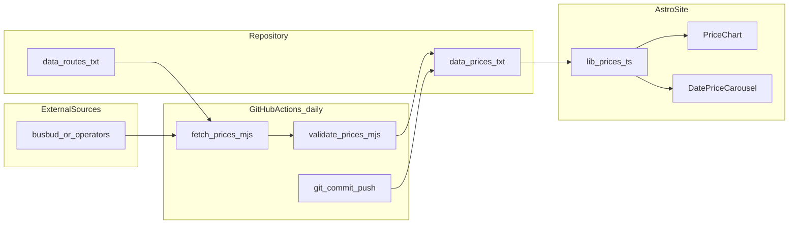

# Data Pipeline: BusTrackerBo

How bus price data flows from external sources into the TXT database and onto the Astro site chart.

## Overview



## Daily Pipeline Steps

### 1. Trigger

GitHub Actions workflow `fetch-prices.yml` runs:

- **Schedule**: `0 6 * * 1` (Mondays 06:00 UTC ≈ 02:00 Bolivia)
- **Manual**: `workflow_dispatch` for on-demand runs

### 2. Fetch (`scripts/fetch-prices.mjs`)

```text
Read latest travel_date from data/prices.txt
  If found: fetch window = [latest+1 .. latest+7] (7 new days, no overlap)
  If empty: fetch window = [tomorrow .. tomorrow+6]
Read data/routes.txt
  For each origin → destination pair:
    For each enabled source (ticketsbolivia-travel, busbud, …):
      Fetch operators/prices for that route
      Append one row per operator × each day in the window
Log: routes processed, rows appended, errors
```

Each cron run extends or refreshes a **7-day travel window** anchored on the latest date already stored in `prices.txt`.

**Error handling**:

- Log and continue if one route fails; do not abort entire run.
- Exit code `1` only if zero routes succeed or validation fails.

### 3. Validate (`scripts/validate-prices.mjs`)

Runs after fetch, before commit:

- Parse entire `data/prices.txt`
- Check header, field count, types, slug registry
- Exit `1` on failure (prevents bad data commit)

### 4. Commit

If `data/prices.txt` changed:

```bash
git config user.name "github-actions[bot]"
git config user.email "github-actions[bot]@users.noreply.github.com"
git add data/prices.txt
git commit -m "chore(data): daily price update $(date -u +%Y-%m-%d)"
git push
```

**Strategy**: Direct commit to `main` (prices are public, append-only). Alternative: open PR from `data-bot` branch for review — use if manual QA is needed.

### 5. Site rebuild

- If deploy workflow is wired: push to `main` triggers `build.yml` + deploy.
- Astro reads `data/prices.txt` at **build time** via `prices.ts` (static generation).
- Chart updates on next deploy after daily commit.

## Read Pipeline (site)

At build or page render:

1. `index.astro` receives query params: `?origin=santa-cruz&destination=tarija&date=2026-07-15`
2. Calls `getPriceHistory(origin, destination, 30)`.
3. `prices.ts` reads and parses `data/prices.txt`.
4. Filters rows matching route slugs.
5. Dedupes by latest `fetched_at` per operator/date.
6. Aggregates min price per `travel_date`.
7. Passes `DailyPrice[]` to `PriceChart` and `DatePriceCarousel`.

## File Responsibilities

| File | Role |
|------|------|
| `data/routes.txt` | Input: which routes to fetch |
| `data/prices.txt` | Output: append-only price DB |
| `scripts/fetch-prices.mjs` | Fetch + append writer |
| `scripts/validate-prices.mjs` | Schema gate before commit |
| `src/lib/prices.ts` | Read + query for UI |
| `src/lib/cities.ts` | Slug validation and labels |

## Local Development

```bash
# Run fetch manually (may need network + source implementation)
node scripts/fetch-prices.mjs

# Validate after fetch or manual edits
node scripts/validate-prices.mjs

# Preview site with updated data
npm run dev
```

For UI work without a live fetcher, use `manual-seed` rows in `data/prices.txt`.

## Environment Variables

| Variable | Used by | Required | Description |
|----------|---------|----------|-------------|
| `USD_BOB_RATE` | `fetch-prices.mjs` | no | USD → BOB conversion if source returns USD |
| `PRICE_SOURCE_API_KEY` | fetch script | no | If a licensed API is used later |
| `GITHUB_TOKEN` | GHA | yes (default) | Provided by Actions for git push |

Never commit secrets. Store in GitHub repository secrets if needed.

## Monitoring

- GHA workflow summary: log routes processed, rows added, duration.
- Optional: fail workflow if no new rows for 3 consecutive days (stale data alert).
- Display `getLatestFetch()` on home page as "Actualizado {date}" badge.

## Related Docs

- [TXT Database Schema](txt-database-schema.md)
- [Data Sources](data-sources.md)
- [CI/CD](cicd-github-actions.md)
- [Architecture](architecture.md)
